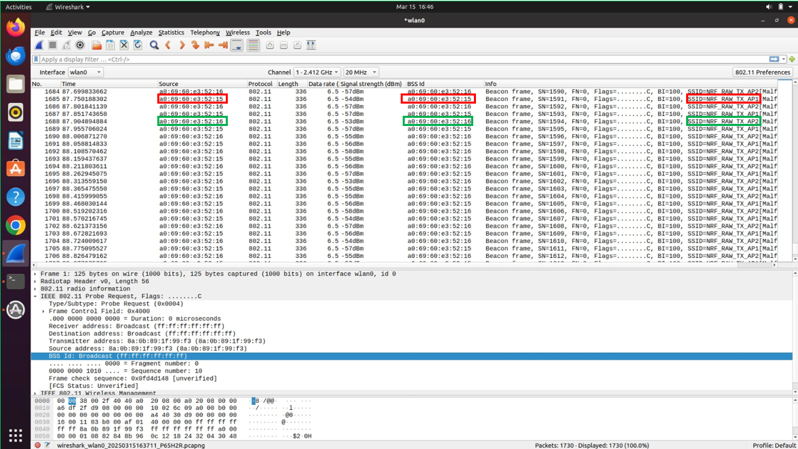
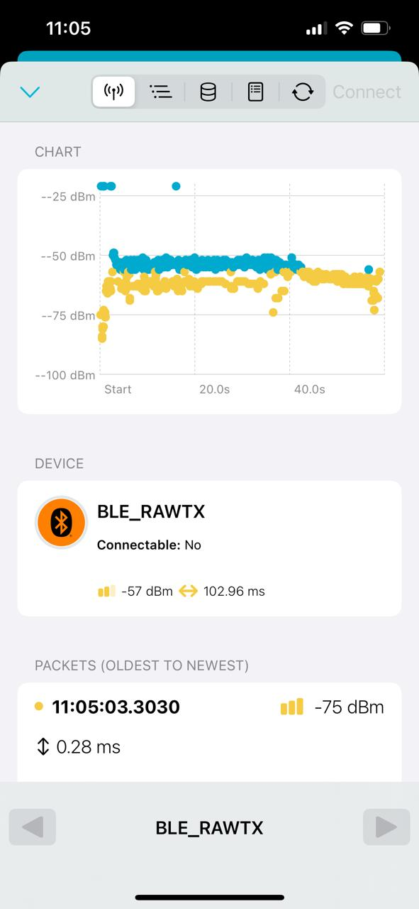

# ble_wifi_beacon

# Sample functionality

Combined build for Wi-Fi and BLE 

- Wi-Fi in Raw tx mode (non-connected mode)

  - Transmitting two beacons each with 51ms interval with unique SSID & BSSID to emulate two APs (AP1 and AP2) beaconing at ~102ms (timing is configurable)

  - All parameters like beacon transmission frequency, data rate, payload/length, channel etc are configurable as usual

- BLE

  - Configured as a peripheral in Advertising mode (scannable but not connectable)

  - Transmits continuous adv packets#

# Building

Install NCS v2.9.1, put the repository folder under ncs\nrf\samples\wifi\ble_wifi_beacon and build as it an normal sample.


## Build commands

```
nRF7002 DK - west build -b nrf7002dk/nrf5340/cpuapp -- -DCONFIG_RAW_TX_PKT_SAMPLE_NON_CONNECTED_MODE=y -DCONFIG_RAW_TX_PKT_SAMPLE_TX_MODE_CONTINUOUS=y -DCONFIG_RAW_TX_PKT_SAMPLE_INTER_FRAME_DELAY_MS=51
```

```
nRF54L15 + nRF7002eb2 - west build -p -b nrf54l15dk/nrf54l15/cpuapp -- -Dble_rawtx_SHIELD=nrf7002eb2 -Dble_rawtx_SNIPPET=nrf70-wifi -DCONFIG_RAW_TX_PKT_SAMPLE_NON_CONNECTED_MODE=y -DCONFIG_RAW_TX_PKT_SAMPLE_TX_MODE_CONTINUOUS=y -DCONFIG_RAW_TX_PKT_SAMPLE_INTER_FRAME_DELAY_MS=51
```


# Modify Wi-Fi beacon MAC addresses

```
diff --git a/src/main.c b/src/main.c
index 779cc34..4d4a02f 100644
--- a/src/main.c
+++ b/src/main.c
@@ -73,8 +73,8 @@ static struct beacon test_beacon_frame = {
        .duration = 0X0000,
        .da = {0XFF, 0XFF, 0XFF, 0XFF, 0XFF, 0XFF},
        /* Transmitter Address: A0:69:60:E3:52:15 */
-       .sa = {0XDD, 0XEE, 0XAA, 0XDD, 0XBB, 0X01},
-       .bssid = {0XDD, 0XEE, 0XAA, 0XDD, 0XBB, 0X01},
+       .sa = {0XA0, 0X69, 0X60, 0XE3, 0X52, 0X15},
+       .bssid = {0XA0, 0X69, 0X60, 0XE3, 0X52, 0X15},
        .seq_ctrl = 0X0001,
        /* SSID: NRF_RAW_TX_AP1 */
        .payload = {
@@ -110,15 +110,15 @@ static void flip_beacons(void) {

        if (flag == 0) {
                flag = 1;
-               test_beacon_frame.sa[5] = 0x01;
-               test_beacon_frame.bssid[5] = 0x01;
+               test_beacon_frame.sa[5] = 0x15;
+               test_beacon_frame.bssid[5] = 0x15;
                test_beacon_frame.payload[27] = 0x31;
                //LOG_ERR("Sending AP1 beacon frame");
        } else {
                flag = 0;
                //LOG_ERR("Sending AP2 beacon frame");
-               test_beacon_frame.sa[5] = 0x02;
-               test_beacon_frame.bssid[5] = 0x02;
+               test_beacon_frame.sa[5] = 0x16;
+               test_beacon_frame.bssid[5] = 0x16;
                test_beacon_frame.payload[27] = 0x32;
        }
 }
```

# Verification

Wi-Fi Beacons from the two emulated APs, AP1 and AP2, Wireshark screenshot:

BLE periodic Advertisements from nRF Connect for Mobile app:

